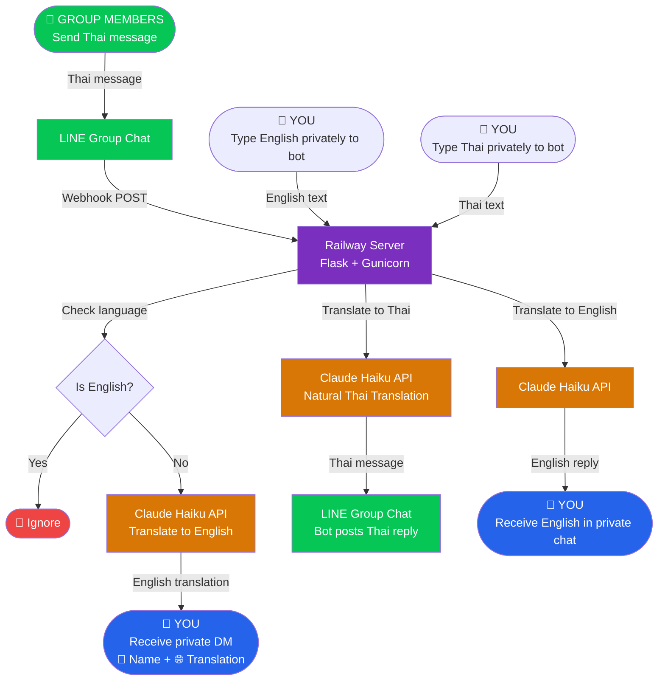

# 🤖 LINE Translation Bot

[](https://www.python.org/)
[](https://developers.line.biz/)
[](https://www.anthropic.com/)
[](https://railway.app/)
[](LICENSE)

An AI-powered LINE translation bot that privately translates Thai group messages to English, and sends your English replies as natural Thai directly to the group — powered by Claude Haiku.

---

## ✨ Features

- 🔤 **Auto-detects language** — no manual configuration needed
- 🇹🇭 → 🇬🇧 Translates Thai group messages to English privately
- 🇬🇧 → 🇹🇭 Translates your English replies to natural Thai posted in group
- 👤 **Shows sender name** with every private translation
- 🚫 **Ignores your own messages** in the group
- 🚫 **Ignores English messages** from others (no unnecessary noise)
- 💬 **Private chat mode** — send Thai to bot, get English back
- 🧠 **Natural casual Thai** — uses ผม, ครับ, conversational tone
- 💰 **Extremely low cost** — ~$0.50/month for personal use
- ☁️ **Runs 24/7** — no PC required, fully cloud-hosted

---

## 🏗️ Architecture



---

## 🔄 How It Works

### Scenario 1 — Group message translation
```
Thai member sends message in group
        ↓
Bot detects non-English language
        ↓
Claude Haiku translates to English
        ↓
You receive private DM: "👤 Jay\n🌐 Translation:\n\nHow are you today?"
```

### Scenario 2 — You reply to group in Thai
```
You privately message bot in English: "I'm doing great, thanks!"
        ↓
Claude Haiku translates to natural casual Thai
        ↓
Bot posts in group: "ผมสบายดีครับ ขอบคุณ"
```

### Scenario 3 — Private translation for yourself
```
You privately message bot in Thai: "สวัสดีครับ"
        ↓
Claude Haiku translates to English
        ↓
Bot replies privately: "Hello / Hi there"
```

---

## 🛠️ Tech Stack

| Component | Technology |
|---|---|
| **Runtime** | Python 3.11+ |
| **Web Framework** | Flask + Gunicorn |
| **Messaging Platform** | LINE Messaging API v3 |
| **AI Translation** | Anthropic Claude Haiku |
| **Cloud Hosting** | Railway |
| **Version Control** | GitHub |

---

## 🚀 Getting Started

### Prerequisites

- [LINE Developer Account](https://developers.line.biz/)
- [Anthropic API Key](https://console.anthropic.com/)
- [Railway Account](https://railway.app/)
- [GitHub Account](https://github.com/)
- Python 3.11+

### Installation

**1. Clone the repository**
```bash
git clone https://github.com/yourusername/your-repo-name.git
cd your-repo-name
```

**2. Install dependencies**
```bash
pip install -r requirements.txt
```

**3. Set environment variables**
```bash
export CHANNEL_ACCESS_TOKEN=your_line_channel_access_token
export CHANNEL_SECRET=your_line_channel_secret
export ANTHROPIC_API_KEY=your_anthropic_api_key
```

**4. Run locally**
```bash
python app.py
```

---

## ☁️ Deployment (Railway)

**1. Push code to GitHub**
```bash
git add .
git commit -m "Initial commit"
git push origin main
```

**2. Connect Railway to your GitHub repo**
- Go to [railway.app](https://railway.app)
- Click **New Project → Deploy from GitHub repo**
- Select your repository

**3. Add Environment Variables in Railway**

| Variable | Description |
|---|---|
| `CHANNEL_ACCESS_TOKEN` | LINE Channel Access Token |
| `CHANNEL_SECRET` | LINE Channel Secret |
| `ANTHROPIC_API_KEY` | Anthropic API Key |

**4. Set your Webhook URL in LINE**
```
https://your-app.railway.app/webhook
```

---

## ⚙️ Configuration

Edit these constants in `app.py` to customize:

```python
# Your LINE User ID (starts with U)
YOUR_USER_ID = "Uxxxxxxxxxxxxxxxxx"

# Target group to post Thai translations into
TARGET_GROUP_ID = "Cxxxxxxxxxxxxxxxxx"
```

---

## 💰 Cost Estimation

Based on personal use (~200 messages/day):

| Service | Cost |
|---|---|
| Railway (free tier) | $0/month |
| Claude Haiku API | ~$0.50/month |
| LINE Messaging API | Free |
| **Total** | **~$0.50/month** |

---

## 📁 Project Structure

```
├── app.py              # Main bot logic
├── requirements.txt    # Python dependencies
├── Procfile            # Railway/Heroku process file
├── README.md           # This file
└── docs/
    └── architecture.md # Detailed architecture notes
```

---

## 🔒 Security Notes

- Never commit API keys to GitHub — use environment variables
- Keep `YOUR_USER_ID` and `TARGET_GROUP_ID` private
- Regularly rotate your LINE Channel Access Token
- Monitor your Anthropic API usage at [console.anthropic.com](https://console.anthropic.com)

---

## 📄 License

This project is licensed under the MIT License — see the [LICENSE](LICENSE) file for details.

---

## 🙏 Acknowledgements

- [Anthropic](https://www.anthropic.com/) for Claude Haiku AI
- [LINE Developers](https://developers.line.biz/) for the Messaging API
- [Railway](https://railway.app/) for cloud hosting
